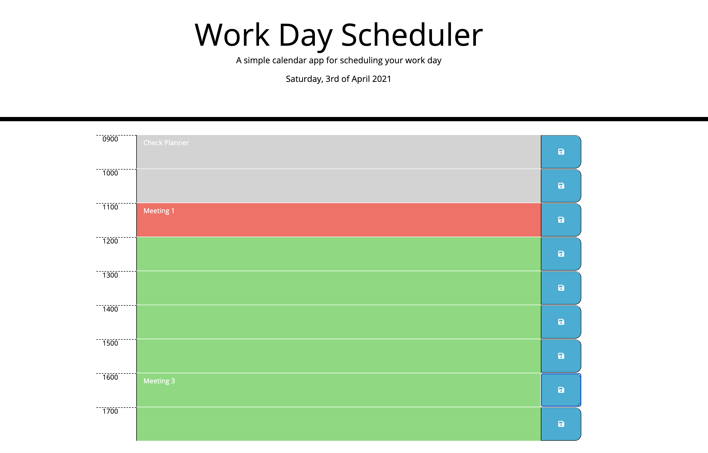
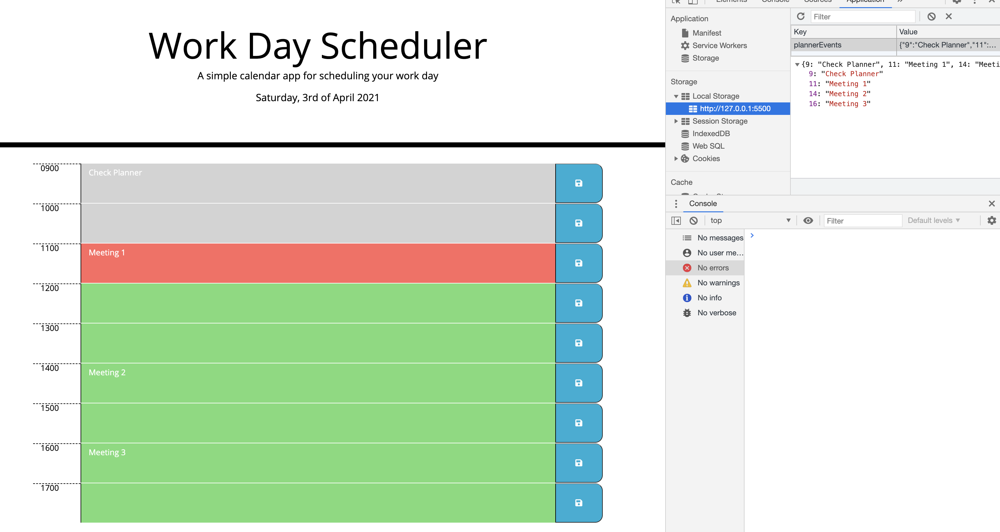

# 05 Work Day Planner

## Task:

To create a simple calendar application that allows a user to save events for each hour of the working day (9AM-5PM).

### Methodology

Main Actions:

1.  Drafted a wireframe outlining the main tasks of building a simple day planner;
2.  Using the html and css provided, created time blocks from 9AM-5PM;
3.  Added the date in the main.js using moment.js;
4.  Packages used to code the planner: css, moment js and jquery; this enabled to highlight the current time in red, all past time blocks as grey and future time blocks as green;
5.  The work day planner was successful in being deployed.

# Screenshots

Please note screen shots of working web app:

Image 1 to show deployed application URL: 

Image 2 to show : 

# Link to GitHub Repository:

https://github.com/BKay1/work-day-planner

# Link to Deployed Application:

https://bkay1.github.io/work-day-planner/
